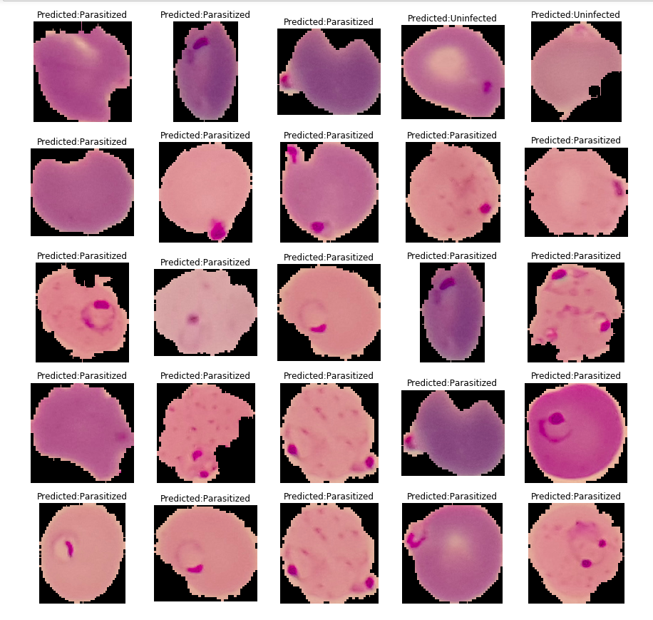

# Malaria Detection using Deep-Learning

This is a project of detecting Malaria from cell images. The codes are based on implementation of ResNet50 on Python 3, Keras and TensorFlow which is trained from scratch.The model classifies the image as Parasitized or Uninfected.

# Data

* I found a great dataset that consists of 27,558 single cell images with an equal number - 13,794 images - of infected and uninfected cells.
* The cells are from 200 patients where three out of every four patients had malaria.
* Single cells were segmented from images of microscope fields of view.
* All images were manually annotated by an expert slide reader.
* I split the dataset in 80% training and 20% testing data where out of 80% training data, I take 10% for validation data. This is defined in [build_dataset.py](build_dataset.py).

For more information, please visit the [US National Library of Medicine](https://ceb.nlm.nih.gov/repositories/malaria-datasets/).

# Model

* I use the ResNet50 implemented in Keras for the training.
* I train the ResNet50 from scratch for 50 epochs on Google Colab's Tesla K80 GPU.
* I analyse the model and pick the epoch 48's weights as they have the highest validation accuracy and lowest validation loss.
* I got 97% accuracy on validation dataset and 97% accuracy on test dataset.

You can find the training steps in [Malaria_detection.ipynb](Malaria_detection.ipynb).

# Result

